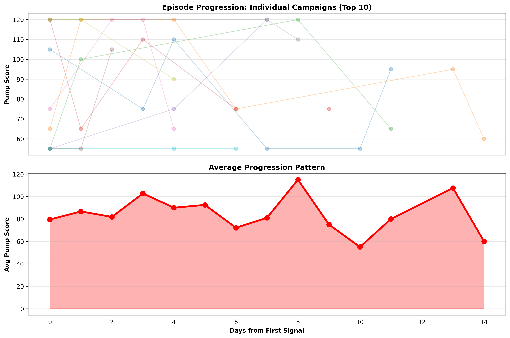
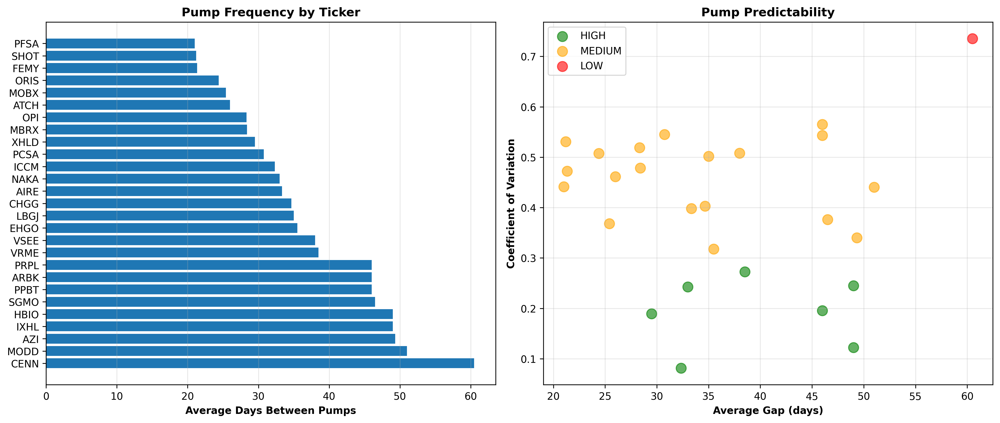
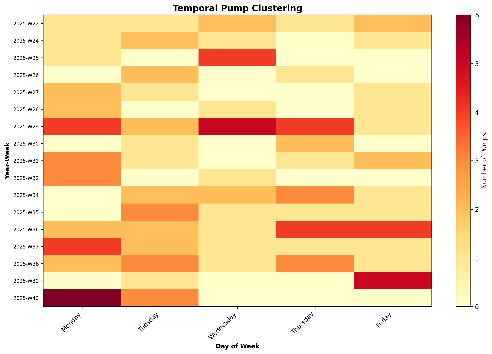

# 🚨 Pennystock Pump Detector  
A real-time surveillance engine for detecting pump-and-dump schemes in small-cap and micro-cap stocks.

This system ingests live market data, detects statistical anomalies, assigns a PumpScore, classifies signals, groups them into coordinated episodes, and generates a complete audit trail with charts, logs, and outcomes.

---

# 📊 Example Outputs

### ✅ Pump Score Progression Across Multi-Day Episodes  
Shows whether pump behavior escalates day-by-day (supports early-warning detection).  

---

### ✅ Pump Interval Analysis  
Identifies repeat-offender tickers and the average time between pump cycles.  

---

### ✅ Temporal Heatmap  
Visualizes which days of the week pumps cluster on.  

---

# ✅ Key Features

### 🔍 **1. Live Pump Detection Engine**
- Calculates real-time volume/price anomalies  
- Computes a *PumpScore* (0–100+)  
- Flags signals automatically when PumpScore > threshold  
- Outputs timestamped alerts + logs  
- Designed for long-running monitoring jobs  

### 📈 **2. Backtesting System**
Every pump signal is backtested with:
- 1, 5, 10, 20-day forward returns  
- Max drawdown  
- Days to bottom  
- Max gain (continued pumping)  
- Days to peak  

### 🧠 **3. Auto Classification**
Each signal becomes:
- `confirmed_pump`  
- `likely_pump`  
- `likely_legit`  
- `uncertain`  
- `insufficient_data`  

### 🗂️ **4. Pump Episode Detection**
Episode clustering detects **coordinated schemes**, grouping signals into multi-day campaigns.

Example fields:
- `episode_key`  
- `signal_count`  
- `avg_pump_score`  
- `duration_days`  
- `episode_pump_rate`  

### 🧰 **5. Organized Dataset Outputs**
All data is saved in a structured folder system:
data/
images/TICKER/ # visual charts
signals_csv/
TICKER/signals.csv
TICKER/backtest.csv
MASTER_TRUTH.csv
MASTER_TRUTH_WITH_EPISODES.csv
PUMP_EPISODES.csv

---

# 📦 Tech Stack

- **Python 3.10+**  
- **Pandas / NumPy** (data processing)  
- **Matplotlib** (charting)  
- **yfinance** (market data ingestion)  
- **SQLite or CSV** (logging and persistence)  

---

# 🚀 How It Works (Pipeline)

### ✅ Step 1 — Analyze Each Ticker  
Pulls 6 months of data → computes features → assigns PumpScore → saves charts.

### ✅ Step 2 — Backtest Signals  
Calculates forward returns, drawdown, and outcomes for each flagged event.

### ✅ Step 3 — Build MASTER_TRUTH Dataset  
Combines signals from all tickers into one authoritative ground-truth file.

### ✅ Step 4 — Detect Pump Episodes  
Applies 7-day clustering per ticker to identify coordinated manipulation.

### ✅ Step 5 — Run Pattern Analysis  
Produces:
- Episode progression curves  
- Pump interval predictions  
- Temporal clustering heatmaps  
- Summary statistics  

---

# 📈 Analysis Summary (Example)

Below is an excerpt from `summary_stats.txt`:
Total signals detected: 187
Confirmed pumps: 92
Likely pumps: 32
Pump detection rate: 66.1%

Total episodes: 41
Multi-day campaigns: 19
Single-day pumps: 22

✅ Pumps cluster on Thursdays
✅ Some tickers show ~28–35 day repeat cycles
✅ Multi-day episodes have rising PumpScores (early warning exists)

---

# 🧪 Example Insights

### ✅ **Early Warning Exists**  
Multi-day pump campaigns show *increasing* PumpScores day-to-day →  
meaning the system can flag coordinated pumps **before the peak**.

### ✅ **Some Tickers Are Repeat Offenders**  
Tickers like NAKA, ORIS, or OPI show multiple pump cycles in the dataset.

### ✅ **Pumps Cluster on Certain Weekdays**  
Your temporal heatmap and chi-square stats show non-uniform clustering.

---

# 🛠️ Setup

git clone https://github.com/jasonorjasor/Pennystock-Pump-Detector.git

cd Pennystock-Pump-Detector
pip install -r requirements.txt

Run full analysis:
python analyze_all.py

(Or whatever your main script is named.)

---

# 📜 License

This project uses the **MIT License**.  
See the `LICENSE` file for details.

---

# 🤝 Contributing

Pull requests are welcome.  
Please open an issue first to discuss proposed changes.

